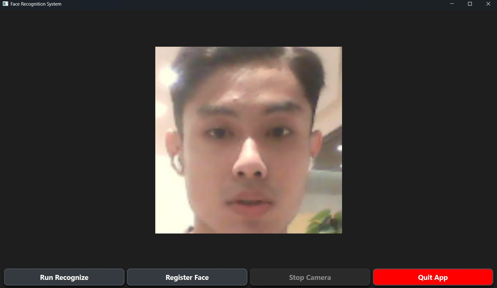
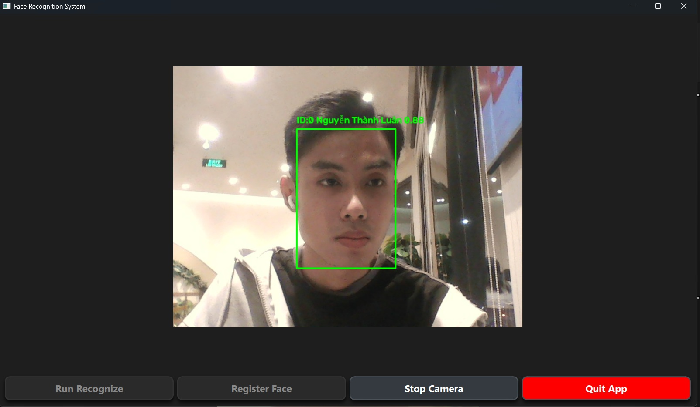

## Overview

This project implements a face recognition system designed for applications such as attendance tracking, identity verification, and access control. The system provides a lightweight custom ResNet architecture with 8 layers as the default backbone. It also supports several models from the iResNet family, although these models require significantly more computational resources for training. Multiple loss functions are available for training, including ArcFace, AdaFace, and Triplet Loss. AdaFace is used as the default loss function because of its ability to adapt the classification margin according to image quality. Face embeddings are stored in PostgreSQL using the pgvector extension. The database is deployed and managed through Docker, making the system easier to configure and reproduce across different environments.

For face identification, pgvector supports vector similarity search using metrics such as cosine distance and Euclidean distance. An HNSW index can also be used to accelerate approximate nearest-neighbor searches when the number of stored face embeddings becomes large.

## Demo

<table>
  <tr>
    <td align="center"></td>
    <td align="center"></td>
  </tr>
</table>

## Architecture
<!-- 
### System Architecture

 -->

### Model Architecture


## Dataset

Dataset that I used in this project for training model is WebFace 112x112, and some another is used for testing or demo training like ORL Dataset.

Structure of dataset:

```text
webface_112x112/
├── person_000001/
│   ├── 0001.jpg
│   ├── 0002.jpg
│   ├── 0003.jpg
│   └── ...
├── person_000002/
│   ├── 0001.jpg
│   ├── 0002.jpg
│   └── ...
├── person_000003/
│   └── ...
└── ...
```

## Installation

### 1. Clone Repo and install requirements

~~~bash
git clone 
cd face-recognition-system
pip install -r requirements.txt
~~~

### 2. Setup .env file and database

You need to change the password in .env.example. After that:
~~~bash
cp .env.example .env
docker compose up -d
~~~

After that can run this command to check:
~~~bash
python -m src.database.connection
~~~

If you see "**Connect database successfully!**" is ok.

### 4. Setup checkpoint 

#### 1. Train model
You can run this command to train the model:

~~~bash
python train.py --train_dir "your_dataset" --save_path ".\checkpoints\final" --test_dir "your_dataset"
~~~

Training Configuration:

| Argument            | Type    | Default               | Description            |
| ------------------- | ------- |-----------------------| ---------------------- |
| `--train_dir`       | `str`   | -                     | Training dataset path  |
| `--test_dir`        | `str`   | -                     | Test dataset path      |
| `--save_path`       | `str`   | `./checkpoints/final` | Checkpoint directory   |
| `--val_factor`      | `float` | `0.3`                 | Validation split ratio |
| `--batch_size`      | `int`   | `128`                 | Batch size             |
| `--num_workers`     | `int`   | `4`                   | DataLoader workers     |
| `--prefetch_factor` | `int`   | `4`                   | Prefetch batches       |
| `--model_type`      | `str`   | `mobile`              | Backbone type          |
| `--model_size`      | `int`   | `18`                  | Backbone depth         |
| `--embedding_dim`   | `int`   | `512`                 | Embedding size         |
| `--dropout_rate`    | `float` | `0.3`                 | Dropout rate           |
| `--loss_type`       | `str`   | `arc`                 | Loss function          |
| `--margin`          | `float` | `0.4`                 | Margin                 |
| `--scale`           | `float` | `64.0`                | Scale factor           |
| `--t_alpha`         | `float` | `0.01`                | EMA factor (AdaFace)   |
| `--num_epochs`      | `int`   | `100`                 | Training epochs        |
| `--lr`              | `float` | `0.1`                 | Learning rate          |
| `--weight_decay`    | `float` | `5e-4`                | Weight decay           |
| `--num_thresholds`  | `int`   | `400`                 | Evaluation thresholds  |
| `--target_at_far`   | `float` | `0.01`                | Target FAR             |


#### 2. Run CLI Face Verification

You can run this command to run CLI for face verification task between 2 images:

~~~bash
python -m src.face_identification.inference --img_path1 "path_your_image1" --img_path2 "path_your_image2" --threshold 0.6 --cp_path "path_your_checkpoint"
~~~

| Argument | Type | Default | Description                                                              |
|----------|------|---------|--------------------------------------------------------------------------|
| `--img_path1` | `str` | - | Path to the first input face image.                                      |
| `--img_path2` | `str` | - | Path to the second input face image.                                     |
| `--cp_path` | `str` | `.\checkpoints\final\checkpoints\best.pth` | Path to the trained model checkpoint.                                    |
| `--model_type` | `str` | `base` | Model for creating embedding (`base` or `iresnet`).                      |
| `--model_size` | `int` | `18` | Depth of the model for loading model (18, 34, 50, 100, or 200).          |
| `--embedding_dim` | `int` | `512` | Dimension of the output face embedding vector for loading model.         |
| `--dropout_rate` | `float` | `0.3` | Dropout rate for loading model.                                          |
| `--threshold` | `float` | `0.4` | Similarity threshold for face verification.                              |
| `--mode` | `str` | `cosine` | Similarity metric (`cosine` or `euclid`).                                |
| `--show` | `flag` | `False` | Display the input image was cropped. Enabled when `--show` is specified. |

### 5. Run App

Run this command to run API server:
~~~bash
uvicorn src.api.main:app --reload
~~~
Run this command to run PyQT App:

~~~bash
python app.py
~~~

## Reference

This project is implemented flowing papers:

- AdaFaceLoss: https://arxiv.org/pdf/2204.00964
- ArcFaceLoss: https://arxiv.org/pdf/1801.07698
- MobileFaceNet: https://arxiv.org/pdf/1804.07573
- Iresnet model is got from repo of AdaFaceLoss