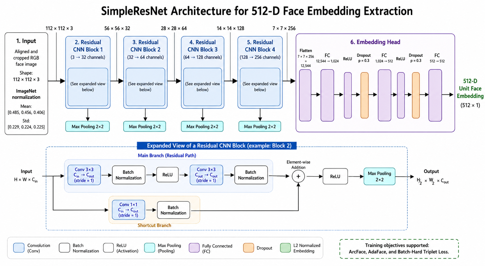

## Overview

This project implements a face recognition system designed for applications such as attendance tracking, identity verification, and access control. The system provides a lightweight custom ResNet architecture with 8 layers as the default backbone. It also supports several models from the iResNet family, although these models require significantly more computational resources for training. Multiple loss functions are available for training, including ArcFace, AdaFace, and Triplet Loss. AdaFace is used as the default loss function because of its ability to adapt the classification margin according to image quality. Face embeddings are stored in PostgreSQL using the pgvector extension. The database is deployed and managed through Docker, making the system easier to configure and reproduce across different environments.

For face identification, pgvector supports vector similarity search using metrics such as cosine distance and Euclidean distance. An HNSW index can also be used to accelerate approximate nearest-neighbor searches when the number of stored face embeddings becomes large.

## Demo

<table>
  <tr>
    <td align="center"></td>
    <td align="center"></td>
  </tr>
</table>

## Architecture

### System Architecture

### Model Architecture

## Installation

### 1. Clone Repo

~~~bash
git clone 
cd face-recognition-system
~~~

### 2. Setup .env file and database

You need to change the password in .env.example. After that:
~~~bash
cp .env.example .env
docker compose up -d
~~~

After that can run this command to check:
~~~bash
python -m src.database.connection
~~~

If you see "**Connect database successfully!**" is ok.

### 4. Setup checkpoint 

#### 1. Train model
You can run this command to train the model:

~~~bash
python train.py --root_dir "your_dataset" --save_path ".\checkpoints\final" --batch_size 32 --num_workers 4 --model_type base --dropout_rate 0.3 --loss_type ada --num_epochs 100 --lr 5e-3
~~~

Training Configuration:

| Argument          | Type    | Default                          | Description                                                    |
| ----------------- | ------- |----------------------------------|----------------------------------------------------------------|
| `--root_dir`      | `str`   | `.\data\webface\webface_112x112` | Path to the face image dataset.                                |
| `--save_path`     | `str`   | `.\checkpoints\final`            | Directory used to save checkpoints and training results.       |
| `--val_factor`    | `float` | `0.3`                            | Proportion of the dataset used for validation.                 |
| `--batch_size`    | `int`   | `32`                             | Number of samples processed in each batch.                     |
| `--num_workers`   | `int`   | `0`                              | Number of worker processes used for loading data.              |
| `--model_type`    | `str`   | `base`                           | Type of model for creating embedding (`base`, `iresnet`).      |
| `--model_size`    | `int`   | `18`                             | Size or depth of the selected model architecture.              |
| `--embedding_dim` | `int`   | `512`                            | Dimension of the output face embedding vector.                 |
| `--dropout_rate`  | `float` | `0.3`                            | Dropout probability used to reduce overfitting.                |
| `--loss_type`     | `str`   | `ada`                            | Loss function to use, such as `ada`, `arc`, or `triplet`.      |
| `--margin`        | `float` | `0.4`                            | Margin value used by the selected metric learning loss.        |
| `--scale`         | `float` | `64.0`                           | Scaling factor applied to cosine similarity logits.            |
| `--t_alpha`       | `float` | `0.01`                           | Exponential moving average update coefficient used by AdaFace. |
| `--num_epochs`    | `int`   | `1`                              | Total number of training epochs.                               |
| `--lr`            | `float` | `1e-4`                           | Learning rate used by the optimizer.                           |
| `--weight_decay`  | `float` | `5e-4`                           | Weight decay coefficient used for regularization.              |

#### 2. Run CLI Face Verification

You can run this command to run CLI for face verification task between 2 images:

~~~bash
python -m src.face_identification.inference --img_path1 "path_your_image1" --img_path2 "path_your_image2" --threshold 0.6 --cp_path "path_your_checkpoint"
~~~

| Argument | Type | Default | Description                                                              |
|----------|------|---------|--------------------------------------------------------------------------|
| `--img_path1` | `str` | - | Path to the first input face image.                                      |
| `--img_path2` | `str` | - | Path to the second input face image.                                     |
| `--cp_path` | `str` | `.\checkpoints\final\checkpoints\best.pth` | Path to the trained model checkpoint.                                    |
| `--model_type` | `str` | `base` | Model for creating embedding (`base` or `iresnet`).                      |
| `--model_size` | `int` | `18` | Depth of the model for loading model (18, 34, 50, 100, or 200).          |
| `--embedding_dim` | `int` | `512` | Dimension of the output face embedding vector for loading model.         |
| `--dropout_rate` | `float` | `0.3` | Dropout rate for loading model.                                          |
| `--threshold` | `float` | `0.4` | Similarity threshold for face verification.                              |
| `--mode` | `str` | `cosine` | Similarity metric (`cosine` or `euclid`).                                |
| `--show` | `flag` | `False` | Display the input image was cropped. Enabled when `--show` is specified. |

### 5. Run App

Run this command to run PyQT App:

~~~bash
python app.py
~~~